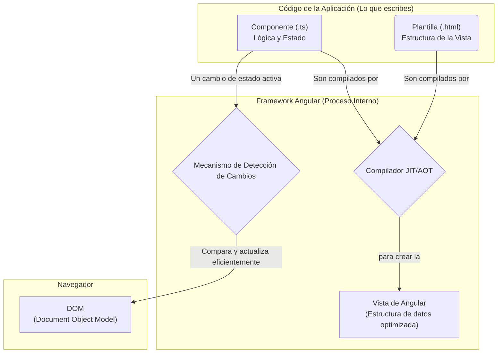
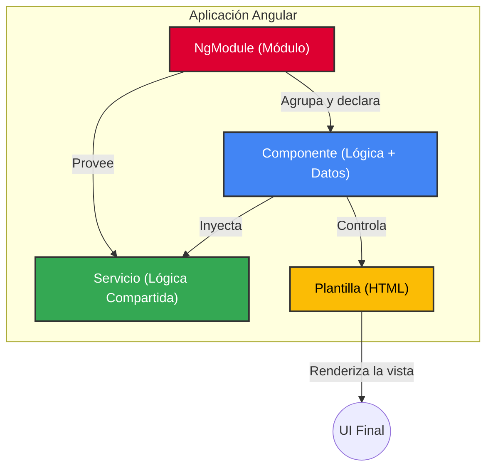

# Guía Maestra de Angular: De Cero a Experto

Este documento es una guía completa diseñada para llevar a un desarrollador desde los conceptos más básicos de Angular hasta un entendimiento profundo de su arquitectura y funcionamiento interno.


---

## 1. Introducción: ¿Qué es Angular?

Angular es una plataforma y framework de desarrollo, mantenido por Google, para construir aplicaciones de una sola página (SPAs) eficientes y sofisticadas. Está escrito en **TypeScript**, un superconjunto de JavaScript que añade tipado estático, lo cual ayuda a construir aplicaciones más robustas y mantenibles.

---

## 2. Los Bloques de Construcción Fundamentales

Toda aplicación en Angular está construida a partir de una serie de "bloques" o conceptos clave. Entender cada uno es el primer paso para dominar el framework.

### Arquitectura Interna del Framework

Angular actúa como una capa de abstracción entre el código que escribes y lo que el navegador renderiza. Esto le permite optimizar las actualizaciones del DOM para un rendimiento máximo. Para una visión más profunda y oficial, puedes consultar la [guía de arquitectura de Angular](https://angular.dev/overview). El siguiente diagrama muestra esta relación:



A continuación, se presenta un diagrama de flujo simplificado que ilustra cómo se conectan estas piezas:



### Módulos (`NgModule`)

Piensa en los módulos como **cajas organizadoras**. Cada aplicación tiene al menos un módulo raíz (`AppModule`) que arranca la aplicación. Los módulos agrupan piezas relacionadas (componentes, servicios, etc.) y pueden importar la funcionalidad de otros módulos.

Un módulo es una clase decorada con `@NgModule`.

```typescript
import { NgModule } from '@angular/core';
import { BrowserModule } from '@angular/platform-browser';
import { AppComponent } from './app.component';

@NgModule({
  declarations: [ // Piezas "visibles" que pertenecen a este módulo.
    AppComponent
  ],
  imports: [ // Otros módulos cuyas clases exportadas son necesarias.
    BrowserModule
  ],
  providers: [], // Servicios disponibles para los componentes de este módulo.
  bootstrap: [AppComponent] // El componente raíz que se carga al iniciar.
})
export class AppModule { }
```

### Componentes

Los componentes son los bloques de construcción básicos de la UI en una aplicación Angular. Un componente controla una porción de la pantalla llamada "vista". Cada componente consiste en:

Un componente siempre se compone de:
1.  **Clase TypeScript**: Contiene los datos y la lógica. Se identifica con el decorador `@Component`.
2.  **Plantilla HTML**: Define la estructura y apariencia de la vista.
3.  **Estilos CSS**: Estilos que se aplican únicamente a la plantilla del componente.

[Componente y Plantilla](https://angular.dev/guide/components)
 
El siguiente diagrama ilustra la conexión directa entre la clase y la plantilla:

```
  +--------------------------+         +----------------------------+
  |   mi-componente.ts       |         |   mi-componente.html       |
  |                          |         |                            |
  | @Component({             |         |  <h1>{{ titulo }}</h1>     |
  |   templateUrl: './mi-comp.html' >------>|  <p>Mi App funciona!</p>   |
  | })                       |         |                            |
  | export class MiComponente{ |         +----------------------------+
  |   titulo = 'Mi App';     |
  | }                        |
  +--------------------------+
```

```typescript
import { Component } from '@angular/core';

@Component({
  selector: 'app-root', // Etiqueta CSS para usar este componente en el HTML
  templateUrl: './app.component.html', // Ruta a la plantilla HTML
  styleUrls: ['./app.component.css'] // Ruta a los estilos
})
export class AppComponent {
  title = 'mi-app'; // Lógica y datos del componente
}
```

### Servicios e Inyección de Dependencias

Los servicios son clases que encapsulan lógica de negocio o datos que no están asociados a una vista específica. Los componentes pueden delegar tareas como obtener datos de un servidor a un servicio.

Angular utiliza la **Inyección de Dependencias (DI)** para proporcionar a los componentes las instancias de servicios que necesitan.

### Enlace de Datos (Data Binding)

El enlace de datos es el mecanismo que sincroniza los datos entre la clase del componente (el modelo) y su plantilla (la vista). Facilita la comunicación entre ambas partes.


*   **Desde el Componente a la Vista:**
    *   **Interpolación `{{valor}}`**: Muestra valores de la clase en el HTML.
    *   **Enlace de Propiedad `[propiedad]="valor"`**: Asigna un valor a una propiedad de un elemento HTML.
*   **Desde la Vista al Componente:**
    *   **Enlace de Evento `(evento)="handler()"`**: Ejecuta una función de la clase cuando ocurre un evento en la vista (como un clic).
*   **Enlace de Doble Vía `[(ngModel)]="propiedad"`**: Combina el enlace de propiedad y de evento para mantener sincronizados los datos en ambas direcciones, muy común en formularios.

### El DOM y la Detección de Cambios

#### ¿Qué es el DOM?

El **DOM (Document Object Model)** o Modelo de Objetos del Documento es una representación en memoria de la estructura de un documento HTML. Es un árbol de nodos donde cada nodo representa una parte de la página (como un elemento `<div>`, un párrafo `<p>` o un texto).

JavaScript puede interactuar con el DOM para leer o modificar el contenido, la estructura y el estilo de una página web de forma dinámica. Sin embargo, manipular el DOM directamente puede ser complejo y afectar el rendimiento si no se hace de manera eficiente.

#### El Proceso de Angular: Detección de Cambios

Angular nos abstrae de manipular el DOM directamente. En su lugar, utiliza un mecanismo altamente optimizado llamado **Detección de Cambios (Change Detection)**.

El flujo es el siguiente:

```
 (1) Evento del Usuario o dato de API
      |
      v
 (2) Actualiza el estado en el Componente (ej: this.nombre = "nuevo valor")
      |
      v
 (3) Se dispara la Detección de Cambios de Angular
      |
      v
 (4) Angular compara el estado anterior con el nuevo
      |
      +-----> Si hay cambios en datos enlazados...
      |
      v
 (5) Angular actualiza SOLO la parte afectada del DOM en el navegador

```

Este enfoque es mucho más eficiente que volver a renderizar toda la página, lo que resulta en aplicaciones más rápidas y fluidas. El desarrollador solo se preocupa por cambiar los datos del componente, y Angular se encarga del resto.

### Ciclo de Vida del Componente

Desde que Angular crea un componente hasta que lo destruye, este pasa por un ciclo de vida con varias fases. Angular nos ofrece "ganchos" (hooks), que son métodos que podemos implementar en nuestras clases de componentes para ejecutar código en momentos clave de este ciclo.

!Diagrama del Ciclo de Vida del Componente

Los ganchos más importantes en orden de ejecución son:

1.  **`constructor()`**: Se ejecuta primero. Ideal para la inyección de dependencias. **No uses lógica compleja aquí**, ya que las propiedades `@Input()` aún no están disponibles.

2.  **`ngOnChanges()`**: Se ejecuta cuando se inicializa o cambia el valor de una propiedad de entrada (`@Input()`).

3.  **`ngOnInit()`**: Se ejecuta **una sola vez** después del primer `ngOnChanges()`. Es el lugar perfecto para la lógica de inicialización, como llamar a un servicio para cargar datos.

4.  **`ngAfterViewInit()`**: Se ejecuta **una sola vez** después de que la vista del componente y sus vistas hijas se han inicializado. Ideal para interactuar con elementos del DOM usando `@ViewChild`.

5.  **`ngOnDestroy()`**: Se ejecuta justo antes de que el componente sea destruido. Es **crucial** para liberar recursos, como desuscribirse de `Observables`, para evitar fugas de memoria.

#### Ejemplo de Implementación

```typescript
import { Component, OnInit, OnChanges, OnDestroy, Input, SimpleChanges } from '@angular/core';

@Component({
  selector: 'app-ciclo-vida',
  template: `<h1>{{ miPropiedad }}</h1>`
})
export class CicloVidaComponent implements OnInit, OnChanges, OnDestroy {

  @Input() miPropiedad: string;

  constructor() {
    console.log('1. constructor: La propiedad @Input aún no está disponible.');
  }

  ngOnChanges(changes: SimpleChanges) {
    console.log('2. ngOnChanges: Se detectó un cambio en las propiedades.', changes);
  }

  ngOnInit(): void {
    console.log('3. ngOnInit: Componente inicializado. Ideal para cargar datos iniciales.');
  }

  ngOnDestroy(): void {
    console.log('X. ngOnDestroy: Componente a punto de ser destruido. ¡A limpiar la casa!');
  }
}
```

## Angular CLI (Interfaz de Línea de Comandos)

Angular CLI es una herramienta fundamental para inicializar, desarrollar, andamios y mantener aplicaciones Angular directamente desde un shell de comandos.

### Crear una nueva aplicación

```bash
ng new nombre-de-la-aplicacion
```

### Levantar el servidor de desarrollo

Este comando compila la aplicación y la sirve en un servidor local (usualmente `http://localhost:4200/`). La aplicación se recarga automáticamente cuando cambias algún archivo fuente.

```bash
ng serve
# O su versión corta
ng s
```

### Generar artefactos

Puedes generar componentes, módulos, servicios y más con el comando `ng generate`.

**Componente:**
*   Comando largo: `ng generate component nombre-del-componente`
*   Comando corto: `ng g c nombre-del-componente`

**Módulo:**
*   Comando largo: `ng generate module nombre-del-modulo`
*   Comando corto: `ng g m nombre-del-modulo`

**Servicio:**
*   Comando largo: `ng generate service nombre-del-servicio`
*   Comando corto: `ng g s nombre-del-servicio`
